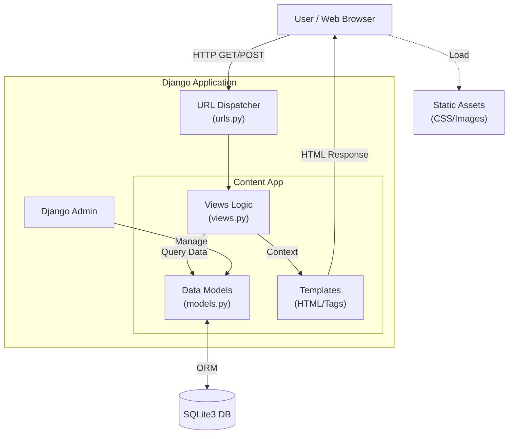

# Personal Website & Portfolio

A Django-based content management system and portfolio website.

## Software Architecture

The application follows the standard Django MVT (Model-View-Template) architecture. Below is a high-level overview of the data flow and system components:

### Core Components
*   **Models**: Defines structure for `Articles`, `Projects`, `Categories`, and `ContactMessages`.
*   **Views**: Class-based views (CBVs) handling logic for lists, details, and form submissions.
*   **Templates**: Responsive Bootstrap 5 layouts for presentation.
*   **Services**: 
    *   **CKEditor**: For rich text content creation.
    *   **SQLite**: Lightweight database for development.
