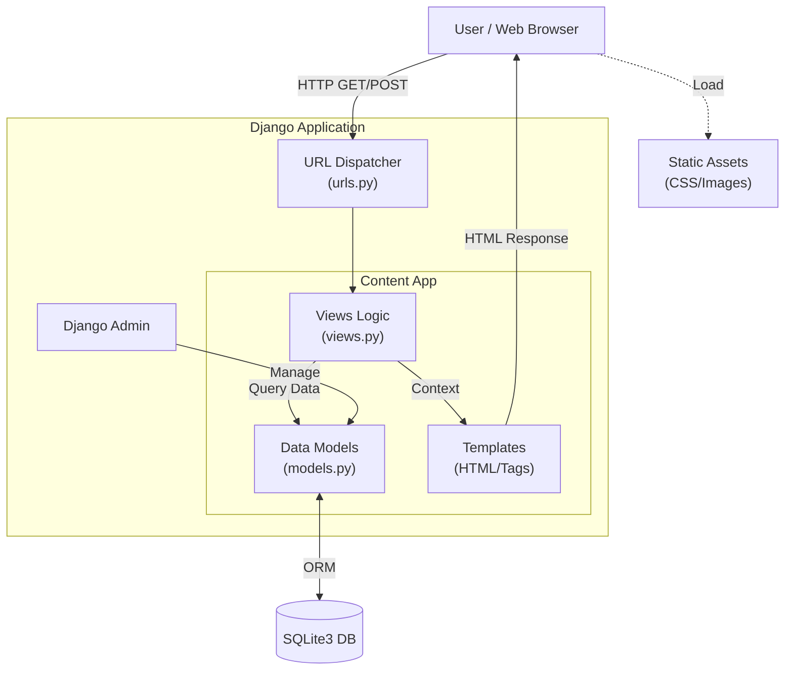
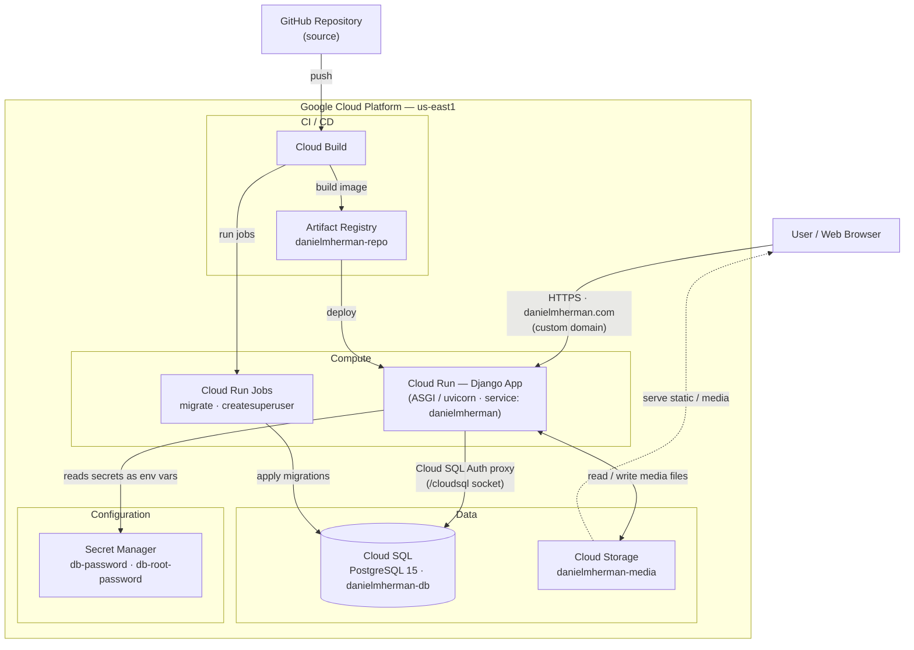

# Personal Website & Portfolio

A Django-based content management system and portfolio website, deployed to
**Google Cloud Platform** — served by **Cloud Run**, backed by **Cloud SQL
(PostgreSQL)** and **Cloud Storage**, with container builds wired to GitHub via
**Cloud Build**.

## Software Architecture

The application follows the standard Django MVT (Model-View-Template)
architecture. Below is the internal data flow and system components, followed
by the Google Cloud Platform deployment the site runs on:

```mermaid
graph TD
    Client["User / Web Browser"]
    
    subgraph "Django Application"
        Router["URL Dispatcher<br/>(urls.py)"]
        
        subgraph "Content App"
            Views["Views Logic<br/>(views.py)"]
            Models["Data Models<br/>(models.py)"]
            Templates["Templates<br/>(HTML/Tags)"]
        end
        
        Admin["Django Admin"]
    end
    
    Database[("SQLite3 DB")]
    Static["Static Assets<br/>(CSS/Images)"]
    
    %% Flow
    Client -->|HTTP GET/POST| Router
    Router --> Views
    
    Views -->|Query Data| Models
    Models <-->|ORM| Database
    
    Views -->|Context| Templates
    Templates -->|HTML Response| Client
    
    Admin -->|Manage| Models
    
    %% Static link
    Client -.->|Load| Static
```

### Deployment Architecture (Google Cloud Platform)

The website runs on **Google Cloud Run** (ASGI/uvicorn) with a managed PostgreSQL
database, object storage for media, and secrets stored in Secret Manager.
Container builds are wired to GitHub through Cloud Build, so a push to `main`
rebuilds and redeploys the service. Memorystore (Redis) is deliberately **not**
part of this deployment.

```mermaid
graph TD
    Client["User / Web Browser"]
    GitHub["GitHub Repository<br/>(source)"]

    subgraph GCP["Google Cloud Platform — us-east1"]
        subgraph Compute["Compute"]
            Web["Cloud Run — Django App<br/>(ASGI / uvicorn · service: danielmherman)"]
            Jobs["Cloud Run Jobs<br/>migrate · createsuperuser"]
        end

        subgraph Data["Data"]
            SQL[("Cloud SQL<br/>PostgreSQL 15 · danielmherman-db")]
            Media["Cloud Storage<br/>danielmherman-media"]
        end

        subgraph Config["Configuration"]
            Secrets["Secret Manager<br/>db-password · db-root-password"]
        end

        subgraph CiCd["CI / CD"]
            Build["Cloud Build"]
            Registry["Artifact Registry<br/>danielmherman-repo"]
        end
    end

    %% Runtime flow
    Client -->|"HTTPS · danielmherman.com<br/>(custom domain)"| Web
    Web -->|"Cloud SQL Auth proxy<br/>(/cloudsql socket)"| SQL
    Web <-->|"read / write media files"| Media
    Media -.->|"serve static / media"| Client
    Web -->|"reads secrets as env vars"| Secrets
    Jobs -->|"apply migrations"| SQL

    %% CI/CD flow
    GitHub -->|"push"| Build
    Build -->|"build image"| Registry
    Registry -->|"deploy"| Web
    Build -->|"run jobs"| Jobs
```

### Core Components
*   **Models**: Defines structure for `Articles`, `Projects`, `Categories`, and `ContactMessages`.
*   **Views**: Class-based views (CBVs) handling logic for lists, details, and form submissions.
*   **Templates**: Responsive Bootstrap 5 layouts for presentation.
*   **Services**: 
    *   **CKEditor**: For rich text content creation.
    *   **Cloud SQL (PostgreSQL)**: Production database (`danielmherman-db`).
    *   **Cloud Storage**: Media and asset storage in production (`danielmherman-media`).
    *   **SQLite**: Lightweight local-development database only.

See [`docs/GCP_DEPLOYMENT_GUIDE.md`](docs/GCP_DEPLOYMENT_GUIDE.md) for the full
deployment and CI/CD walkthrough.
